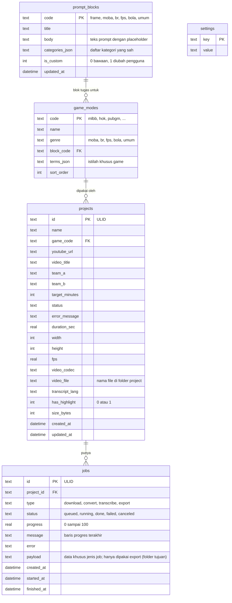

# ERD — SMEditor

Database: SQLite, satu file `data/app.db`, driver `modernc.org/sqlite` (tanpa CGO). Segmen highlight tidak disimpan di database; sumber kebenarannya adalah file `highlight.json` di folder project.

## Diagram

## Catatan tabel

### projects

- `status`: `baru`, `mengunduh`, `gagal_unduh`, `transcript`, `gagal_transcript`, `menunggu_highlight`, `siap_premiere` (lihat `flow.md`).
- Path file tidak disimpan penuh. Folder selalu `data/projects/{id}/`, sehingga folder data bisa dipindah.
- Hapus project: hapus `jobs` terkait (`ON DELETE CASCADE`), lalu folder.

### jobs

- Worker hanya menjalankan satu job `running` pada satu waktu.
- Saat app dinyalakan, job yang masih `running` diubah menjadi `failed` dengan pesan "app ditutup saat job berjalan".
- Indeks: `(status, created_at)` untuk antrean, `(project_id)` untuk halaman project.
- `export` ("Salin ke folder") berbeda dari tiga jenis job lain: `payload`-nya berisi folder tujuan absolut (dihitung dari setting `export_dir` plus nama project yang sudah dibersihkan), dan selesainya tidak mengubah status project.

### prompt_blocks

- Baris `frame` adalah kerangka bersama; baris lain adalah blok tugas per genre.
- Isi awal di-seed dari PRD saat migrasi pertama. Tombol "kembalikan ke bawaan" menulis ulang dari seed.

### game_modes

- `terms_json` berisi pasangan placeholder dan nilainya, misalnya `{"objektif":"Turtle, Lord","bangunan":"Turret, base","penghargaan":"MVP"}`.
- Menambah game baru cukup menambah satu baris yang menunjuk ke blok tugas yang ada.

### settings

| Key | Contoh nilai |
|---|---|
| `ytdlp_path` | `tools/yt-dlp` |
| `ffmpeg_path` | `ffmpeg` |
| `ffprobe_path` | `ffprobe` |
| `whisper_path` | `tools/whisper-cli` |
| `whisper_model` | `tools/models/ggml-medium.bin` |
| `whisper_device` | `auto`, `cpu`, atau `gpu` |
| `export_dir` | Folder tujuan terakhir dipakai di "Salin ke folder"; kosong sampai dipakai sekali |

## Perbedaan dengan PRD

PRD menyebut tiga tabel utama (`projects`, `jobs`, `prompt_templates`). Di sini `prompt_templates` dipecah menjadi `prompt_blocks` dan `game_modes` supaya 12 game bisa berbagi satu blok tugas per genre, dan `settings` ditambahkan untuk lokasi tool.
