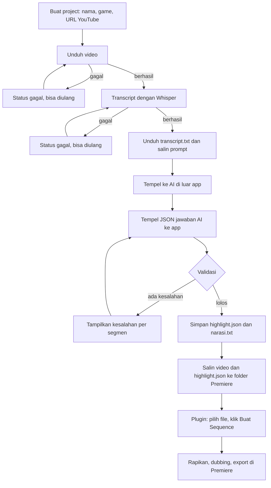
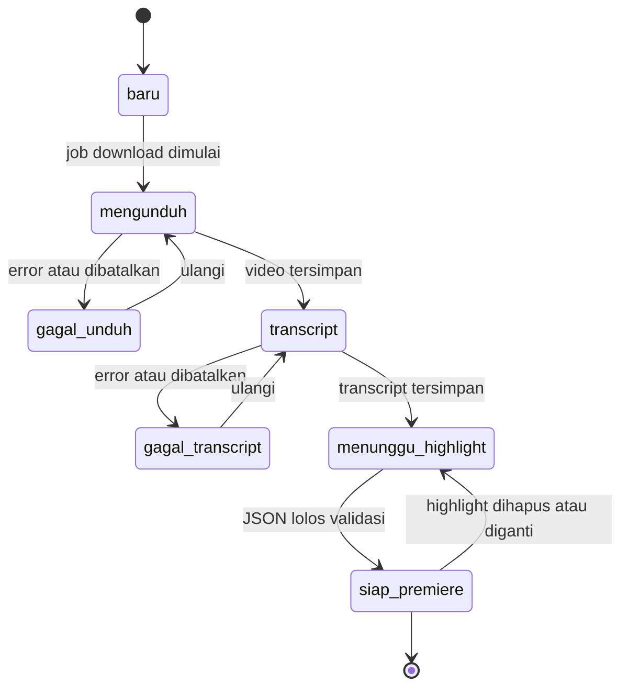
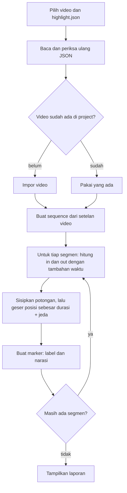

# Flow — SMEditor

Dokumen ini menjelaskan alur kerja sistem dari awal sampai akhir. Rincian kebutuhan ada di `prd.md`, struktur data di `erd.md`, urutan pemanggilan di `sequence.md`, dan pekerjaan di `tickets.md`.

## 1. Gambaran sistem

SMEditor terdiri dari dua bagian yang tidak saling terhubung lewat jaringan. Penghubungnya hanya file.

| Bagian | Jalan di | Tugas |
|---|---|---|
| App web (Go + Vue) | Ubuntu saat pengembangan, Windows saat dipakai | Unduh video, transcript, prompt, validasi highlight |
| Plugin Premiere (CEP) | Windows | Membaca `highlight.json`, memotong video di timeline |

## 2. Alur utama

Langkah A sampai I terjadi di app web. Langkah J dilakukan lewat tombol "Salin ke folder" di app (lihat 4.5a) atau manual lewat "Buka folder project". Langkah K dan L terjadi di Premiere.

## 3. Status project

| Status | Arti | Aksi yang tersedia |
|---|---|---|
| `baru` | Project dibuat, belum ada job | Mulai unduh |
| `mengunduh` | yt-dlp berjalan | Batalkan |
| `gagal_unduh` | Unduh gagal | Ulangi, ubah URL |
| `transcript` | Whisper berjalan | Batalkan |
| `gagal_transcript` | Transcript gagal | Ulangi, ganti bahasa atau model |
| `menunggu_highlight` | Transcript siap | Unduh transcript, salin prompt, tempel JSON |
| `siap_premiere` | `highlight.json` tersimpan | Buka folder, unduh narasi, ganti highlight |

Hapus project tersedia di semua status.

## 4. Rincian tiap langkah

### 4.1 Buat project

1. Pengguna mengisi nama, memilih game, menempel URL YouTube. Nama tim dan target durasi opsional.
2. App memeriksa bahwa URL adalah URL YouTube yang sah.
3. App membuat baris `projects` dan folder `data/projects/{id}/`.
4. Job `download` langsung masuk antrean.

### 4.2 Unduh video

1. Worker mengambil job, mengubah status project menjadi `mengunduh`.
2. yt-dlp dipanggil dengan prioritas H.264 + AAC dalam MP4, 1080p lalu 720p.
3. Progres dibaca dari keluaran yt-dlp dan dikirim ke browser lewat SSE.
4. Setelah selesai, ffprobe membaca durasi, resolusi, fps, dan codec.
5. Jika codec video bukan H.264, job `convert` dibuat untuk mengubahnya ke H.264 supaya aman dibuka di Premiere.
6. Thumbnail diambil dari video.
7. Job `transcribe` masuk antrean otomatis.

### 4.3 Transcript

1. ffmpeg mengekstrak audio ke WAV 16 kHz mono.
2. Whisper dipanggil dengan bahasa yang dipilih (default otomatis).
3. Hasil disimpan sebagai `transcript.json` (lengkap) dan `transcript.txt` (ringkas).
4. Status project menjadi `menunggu_highlight`.

### 4.4 Prompt

1. App merakit prompt dari kerangka bersama, blok tugas genre, dan istilah game.
2. Placeholder (`{judul}`, `{durasi}`, `{tim_a}`, dan seterusnya) diisi dari data project.
3. Pengguna menyalin prompt dan mengunduh `transcript.txt`.

### 4.5 Validasi highlight

1. Pengguna menempel jawaban AI. App membuang pembungkus blok kode jika ada.
2. Aturan validasi:
   - JSON bisa dibaca dan punya field wajib.
   - `mulai` dan `selesai` berformat `HH:MM:SS`.
   - `mulai` lebih kecil dari `selesai`.
   - `selesai` tidak melewati durasi video.
   - Segmen berurutan dan tidak tumpang tindih.
   - `kategori` termasuk daftar kategori genre project.
   - `draft` opsional; jika ada, `pick` tiap tim maksimal 5 dan `ban` boleh kosong.
3. Jika ada kesalahan, app menampilkan daftar kesalahan per segmen dan tidak menyimpan apa pun.
4. Jika lolos, app menulis `highlight.json` (ditambah `video` dan `durasi`) dan `narasi.txt` (hasil draft di bagian atas jika ada, lalu per segmen), status project menjadi `siap_premiere`.

### 4.5b Ubah dan hapus segmen

1. Di daftar highlight, pengguna menekan "Ubah" pada satu segmen dan mengisi form: label, narasi, kategori, waktu mulai, waktu selesai. `alasan` tetap.
2. App mengganti segmen itu di salinan highlight tersimpan, lalu memeriksa seluruh highlight dengan aturan 4.5 yang sama.
3. Jika ada kesalahan, kesalahan tampil di form dan tidak ada file yang ditulis.
4. Jika lolos, app menulis ulang `highlight.json` dan `narasi.txt`. Status project tetap `siap_premiere`.
5. Hapus segmen meminta konfirmasi SweetAlert, lalu berjalan dengan langkah 2–4 yang sama. Segmen terakhir tidak bisa dihapus dengan cara ini (highlight tanpa segmen tidak lolos validasi); pakai "Hapus highlight".

### 4.5c Hasil draft (MOBA)

1. Prompt blok MOBA meminta AI mengisi field `draft`: nama tim, pick (urut, maksimal 5), dan ban kedua tim, hanya dari hero yang disebut caster.
2. Di atas daftar highlight, kartu "Hasil draft" menampilkan pick dan ban kedua tim. Untuk genre MOBA kartu tetap tampil walau belum ada draft.
3. Tombol "Ubah" membuka form nama tim, pick, dan ban (dipisah koma). Simpan memeriksa seluruh highlight dengan aturan 4.5; jika lolos, `highlight.json` dan `narasi.txt` ditulis ulang, jika tidak, kesalahan tampil di form dan file tidak berubah.
4. Plugin Premiere hanya membaca `segmen`; `draft` diabaikan.

### 4.5a Salin ke folder

Tersedia begitu status project `siap_premiere`; tujuannya supaya project di app boleh dihapus tanpa membuat media offline di project Premiere.

1. Pengguna mengisi folder tujuan (default: nilai `export_dir` tersimpan dari pemakaian terakhir).
2. App memeriksa folder tujuan ada dan bisa ditulis, lalu menghitung subfolder bernama project (dibersihkan dari karakter yang tidak sah di Windows dan Linux).
3. Jika subfolder itu sudah ada, app meminta konfirmasi sebelum menimpa.
4. App menyimpan folder tujuan yang diketik sebagai setting `export_dir` baru, lalu mengantrekan job `export`.
5. Job menyalin `source.mp4`, `highlight.json`, dan `narasi.txt` ke subfolder itu, dengan progres dan bisa dibatalkan. Job ini tidak mengubah status project.
6. Setelah selesai, app menampilkan path folder hasil salinan dengan tombol salin.

### 4.6 Plugin Premiere

Nilai default: tambahan waktu 1 detik di awal dan akhir tiap potongan, jeda 1 detik antar potongan. Tambahan waktu dibatasi supaya tidak kurang dari 0 dan tidak melewati durasi video.

### 4.7 Hapus project

1. Konfirmasi SweetAlert.
2. Job yang sedang berjalan untuk project itu dihentikan.
3. Folder `data/projects/{id}/` dihapus.
4. Baris `projects` dan `jobs` terkait dihapus.

## 5. File yang dihasilkan

| File | Dibuat saat | Dipakai oleh |
|---|---|---|
| `source.mp4` | Unduh selesai | Premiere |
| `audio.wav` | Awal transcript | Whisper |
| `transcript.json` | Transcript selesai | Arsip |
| `transcript.txt` | Transcript selesai | AI |
| `highlight.json` | Validasi lolos | Plugin Premiere |
| `narasi.txt` | Validasi lolos | Pengguna saat dubbing |
| `thumbnail.jpg` | Unduh selesai | Daftar project |
