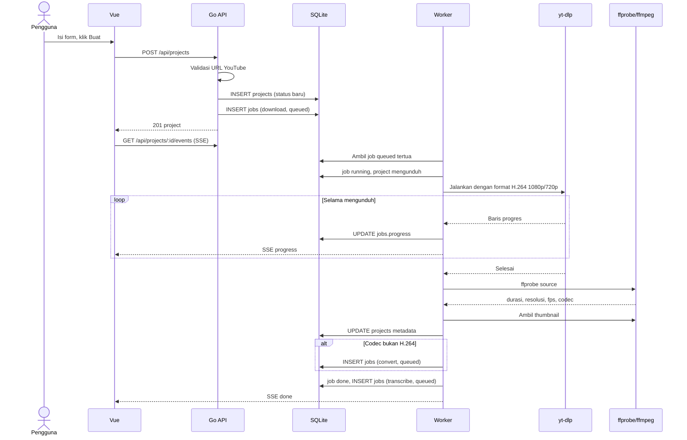
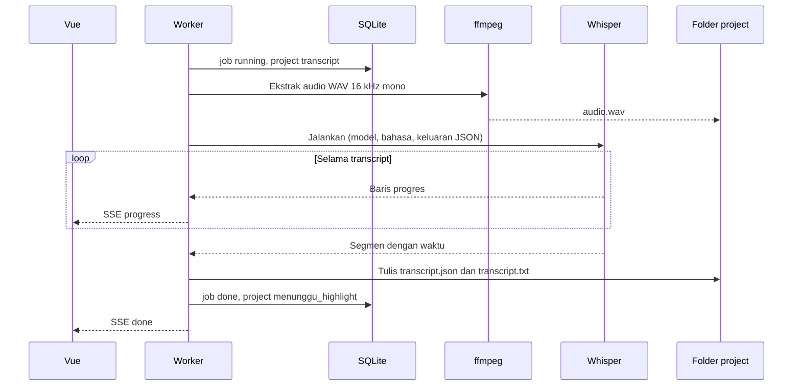
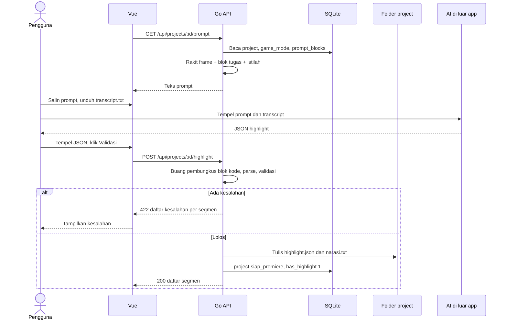
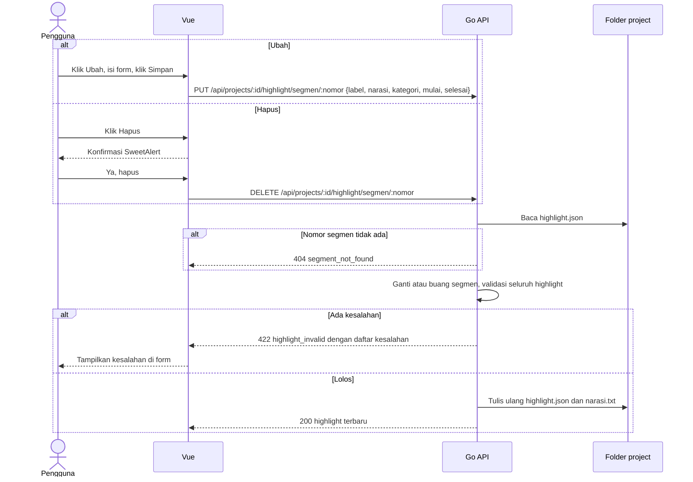
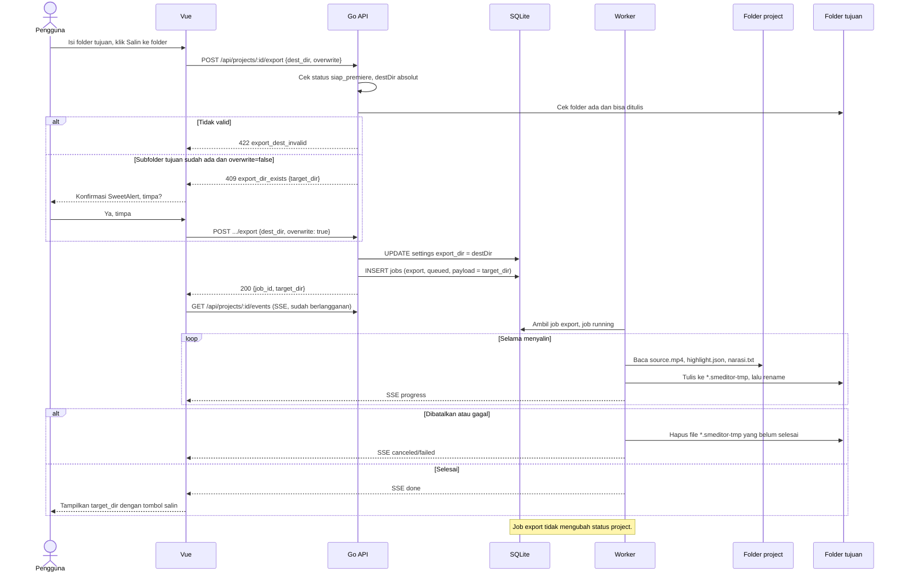
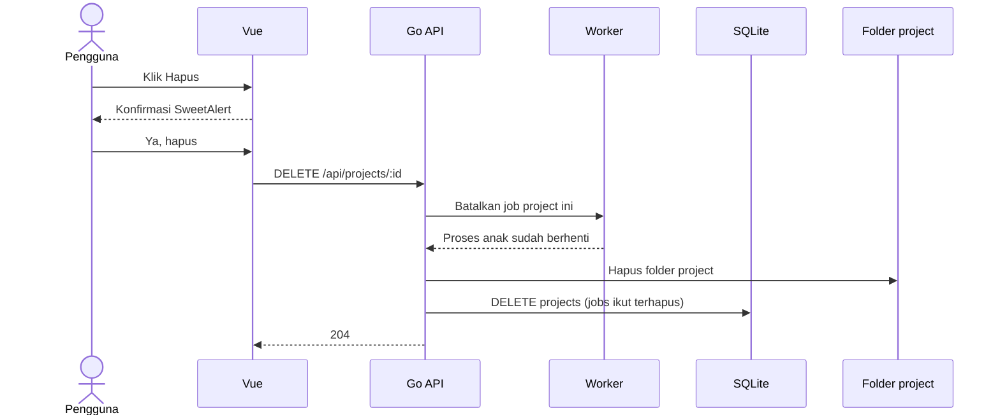
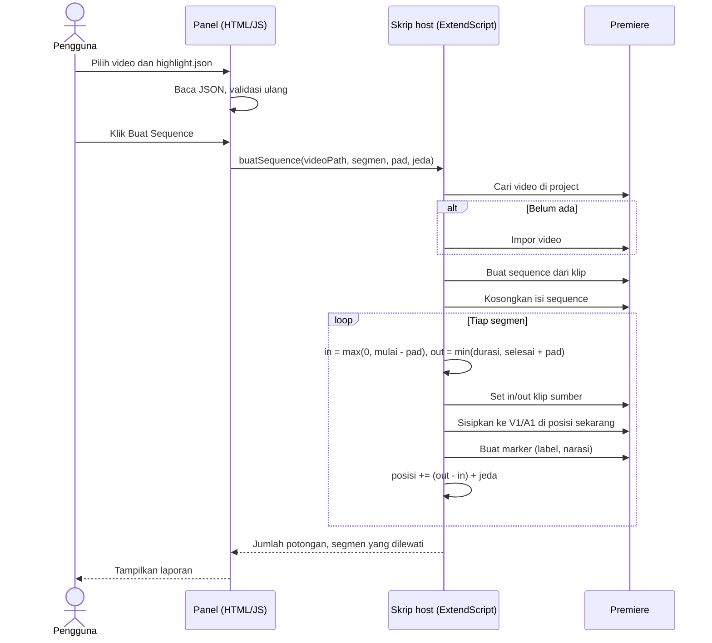

# Sequence — SMEditor

Semua respons API berformat JSON: `{"data": ...}` saat berhasil, `{"error": {"code": "...", "message": "..."}}` saat gagal. Progres job dikirim lewat Server-Sent Events.

## Daftar endpoint

| Method | Path | Fungsi |
|---|---|---|
| GET | `/api/projects` | Daftar project |
| POST | `/api/projects` | Buat project, antrekan unduh |
| GET | `/api/projects/:id` | Detail project dan job terakhir |
| DELETE | `/api/projects/:id` | Hapus project dan semua filenya |
| GET | `/api/projects/:id/thumbnail` | Gambar thumbnail project |
| GET | `/api/projects/:id/video` | Video asli project, mendukung `Range` untuk pratinjau segmen |
| POST | `/api/projects/:id/download` | Ulangi unduh |
| POST | `/api/projects/:id/transcribe` | Ulangi transcript (body: bahasa) |
| POST | `/api/jobs/:id/cancel` | Batalkan job |
| GET | `/api/projects/:id/events` | SSE progres job project |
| GET | `/api/projects/:id/transcript?format=txt\|json` | Unduh transcript |
| GET | `/api/projects/:id/prompt` | Prompt yang sudah dirakit |
| POST | `/api/projects/:id/highlight` | Validasi dan simpan highlight |
| GET | `/api/projects/:id/highlight` | Baca highlight yang sudah tersimpan |
| DELETE | `/api/projects/:id/highlight` | Hapus highlight |
| PUT | `/api/projects/:id/highlight/segmen/:nomor` | Ubah satu segmen (nomor mulai dari 1), validasi ulang, tulis ulang file |
| DELETE | `/api/projects/:id/highlight/segmen/:nomor` | Hapus satu segmen, validasi ulang, tulis ulang file |
| GET | `/api/projects/:id/narasi` | Unduh `narasi.txt` |
| POST | `/api/projects/:id/open-folder` | Buka folder project di file manager |
| POST | `/api/projects/:id/export` | Salin video, highlight.json, narasi.txt ke folder Premiere (job `export`) |
| GET | `/api/game-modes` | Daftar mode game |
| GET, PUT | `/api/prompt-blocks/:code` | Baca dan ubah blok prompt |
| POST | `/api/prompt-blocks/:code/reset` | Kembalikan blok prompt ke bawaan |
| GET, PUT | `/api/settings` | Baca dan ubah pengaturan |
| GET | `/api/settings/check` | Periksa apakah tiap tool ditemukan |

## 1. Buat project dan unduh video

## 2. Transcript

## 3. Prompt dan validasi highlight

## 3b. Ubah atau hapus segmen

## 3a. Salin ke folder

## 4. Hapus project

## 5. Plugin Premiere

